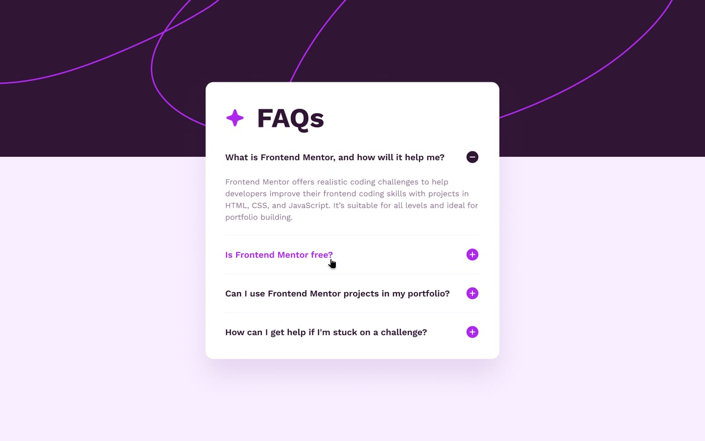
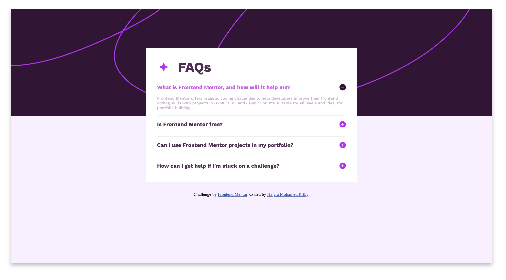
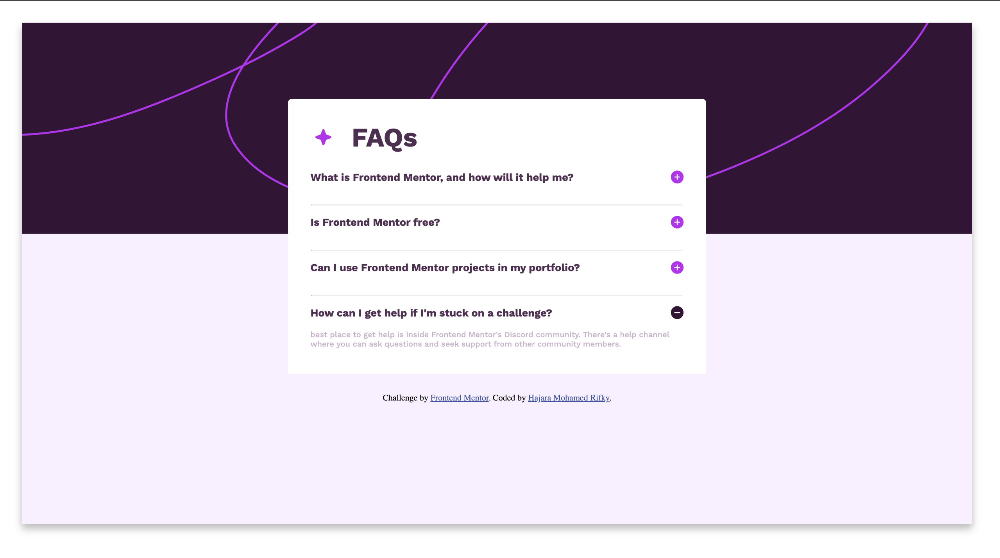
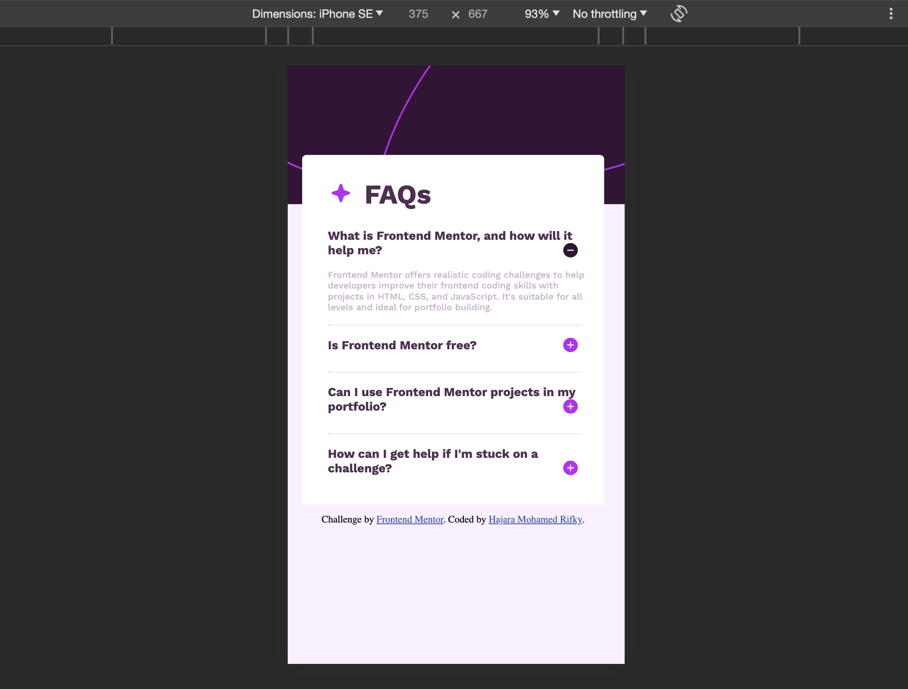

# Frontend Mentor - FAQ accordion solution

This is a solution to the [FAQ accordion challenge on Frontend Mentor](https://www.frontendmentor.io/challenges/faq-accordion-wyfFdeBwBz). This challange was completed with the intention to show that as a developer i am capable of creating web applications exactly as the case give. In this case, i was asked to design a FAQ Page as shown below:

The mobile view:

Active Status:

## Table of contents

- [Overview](#overview)
  - [The challenge](#the-challenge)
  - [Screenshot](#screenshot)
  - [Links](#links)
  - [Built with](#built-with)
  - [What I learned](#what-i-learned)
- [Author](#author)

## Overview

### The challenge

Users should be able to:

- Hide/Show the answer to a question when the question is clicked
- Navigate the questions and hide/show answers using keyboard navigation alone
- View the optimal layout for the interface depending on their device's screen size
- See hover and focus states for all interactive elements on the page

### Screenshot

Challange Completed: 

Desktop View:

Mobile View:

### Links

- Live Site URL: <a href="https://hajararifky.github.io/FAQ-Page-Challenge-Building-with-only-a-sketch/">Click here </a>

### Built with

- Semantic HTML5 markup
- CSS custom properties
- Flexbox
- CSS Grid

### What I learned

Taken the case given, i broke the image into tasks to do and did them one step at a time. 

## Author

- GitHub -(https://github.com/HajaraRifky)
- Linkdin - [@Hajara Rifky](https://www.linkedin.com/in/hajararifky/e)
